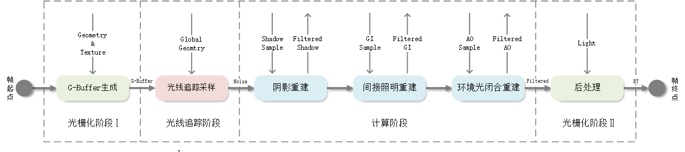
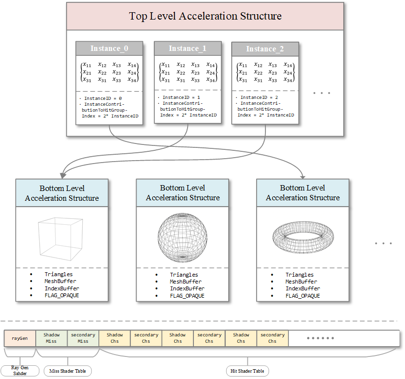
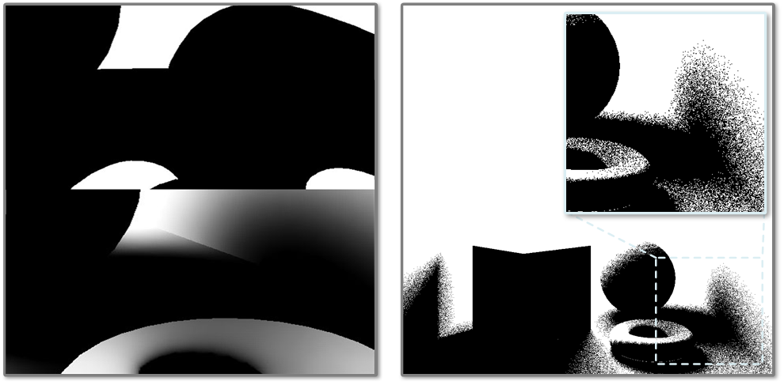
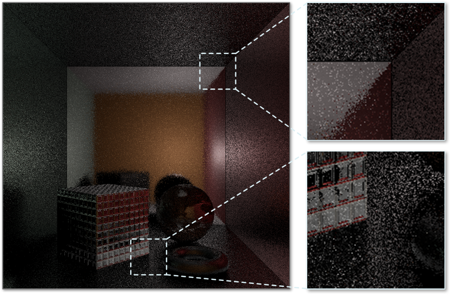
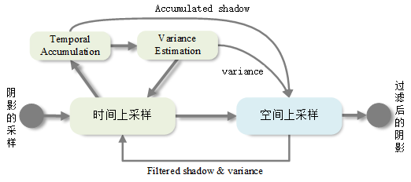
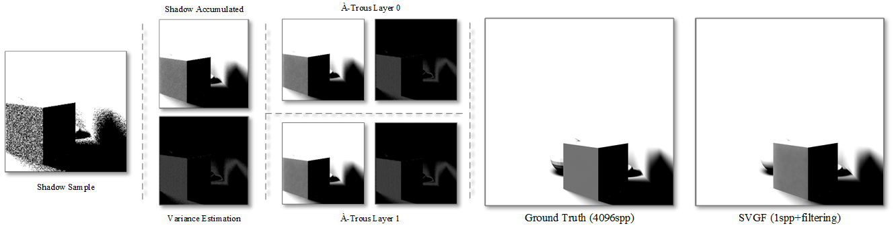
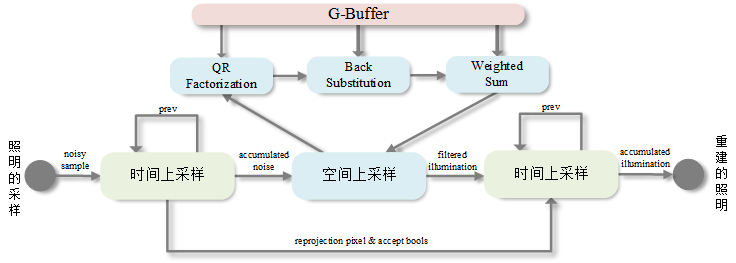
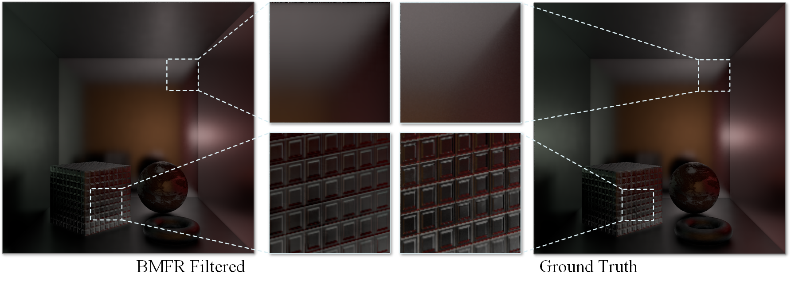

# Ray Traced Hybrid Rendering Pipeline  
## Demo Video Link  
-   [click me](http://47.100.57.110:8079/images/HybridRenderingPipelineDemo.mp4)
## Pipeline Design  
- Stages  
    - Raster Stage - G-Buffer Gen + Post Processing 
    - Ray Tracing Stage - Shaodw/AO/Indirect Illum Sampling
    - Compute Stage - Spatio Temporal Resample
- Pipeline Diagram  
  
## Deferred Shading  
- G-Buffer Design  

    | RGB | A | RT |
    | :----:| :----: |:----:|
    |Position|	Hitness|	RT1|
    |Albedo|	Roughness|	RT2|
    |Normal| Metallic|	RT3|
    |Emissive|	Id|	RT4|
## Ray Tracing Sampeling  
- Acceleration Struture    
  
- Rays per sample pixel  
    - [1 shadow] + [1 ao] + [1 secondary] + [1 secondary shadow] spp  
- Shadow Sampling Illustration    
  
- Indirect Illumination Sampling Illustration    
  
## Computing Filtering and Reconstruction  
- Shadow&AO Reconstruction  
    - Pipeline Design    
      
    - Illuntration    
      
- Illumination Reconstruction  
    - Pipeline Design     
      
    - Illuntration    
      
## Build  
1. install visual studio 2019  
2. modify the "cd D:\Repos\DX12-HybridPipeline" in GenerateProjectFiles.bat to your root  
3. run the GenerateProjectFiles.bat script to build the vs project  